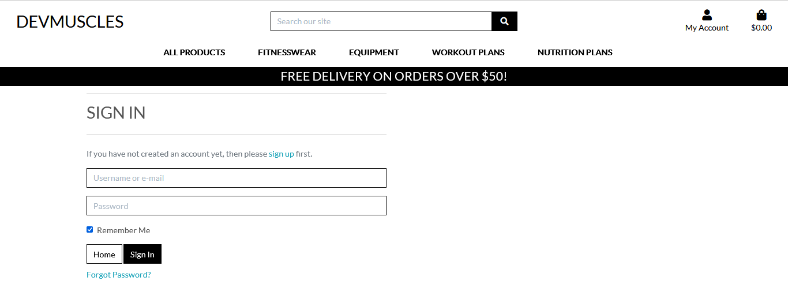
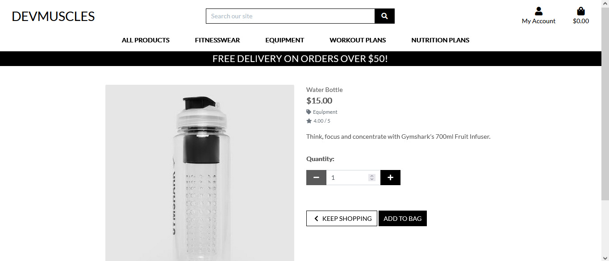

# Milestone-Project-4

<strong>Milestone Project </strong>

<strong>Full Stack Framework With Django</strong> 

<strong>Code Institute</strong>

<strong>DevMuscles</strong> 

An online commerce site where users can buy items relating to fitness(fitnesswear, equipment, plans etc).
The project has a couple of pages:

1:A homepage that allows users to search for items relating to fitness, and view the products in detail.

2:A login page where users can either login or register for an account.

3:Profile page where the user can update their delivery details and see the orders they have made on the site.

4:Page where the admin can edit/delete products that were created on the site.

5:Page where the admin of the site can add or edit categories.

6:Page where the admin of the site can post blogs for users to read.

[Link to website](https://milestone-project-four-muscles.herokuapp.com/) here to see the website.

## Table of Contents
> - [UX](#ux)
> - [User Stories](#user-stories)
> - [Strategy](#strategy)
> - [Scope](#scope)
> - [Structure](#structure)
> - [Surface](#surface)
> - [Features](#features)
> - [Features Left to Implement](#features-left-to-implement)
> - [Technologies Used](#technologies-used)
> - [Libraries](#libraries)
> - [Version Control](#version-control)
> - [Other](#other)
> - [Testing](#testing)
> - [Deployment](#deployment)
> - [Credits](#credits)
> - [Acknowledgments](#acknowledgments)

## UX:

## User Stories:
As a User/Admin:

"I want to see all the products on the site"

As a User:

"I want to be able to signin into the site using an account i created"

"I want to be able to create an account on this site so that i can buy products"

"I want to be able to signout of the site"

"I want to be able to add a product i would like to buy on the site to a shopping bag"

"I want to be able to search for a product on the site"

"I want to be able to go to my profile and update my delivery details and see any orders i have made"

"I want to see a product in more detail"

"I want to be able to edit my shopping bag before it goes to checkout"

"I want to look for products in certain areas instead of having to look at all of them"

"I want to checkout a product"

"I want to see an order i made on the website in detail"

"I want to be able to see blogs that were posted on this site"

As an Admin:

"I want to be able to delete products from the site"

"I want to be able to edit products on the site"

"I want to be able to add products on the site"

"I want to be able to add blog posts to the site"

## Strategy:
I wanted to create a user friendly website that would have Create,Update,Read and Delete (CRUD) functionality as well as site that would accept payments.

## Scope:
I created a database for the products and categories,see below schema.

## Structure:
I wanted users to see all the products that are on the site to buy.

I would then direct them to the product that they want to buy.

The user would then be able to checkout the product but if they want to save the order and their delivery details they would need to register on the site.

After the user has logged in they would now be able to see their orders and their delivery information.

If the admin has logged in they would now have the option of deleting/editing products,and adding blog posts(only through Django admin).

## Surface:
I used text color of black in a white background to make it stand out.

## Features:

<strong>Existing Features:</strong>

<strong>Feature 1:</strong>
The navigation bar on the top will stay to the screen when the user scrolls down the page when viewing on a tablet or phone for easy navigation as well as link back to the index page.

<strong>Feature 2:</strong>
The ability to view and filter products by category,name, price etc.

<strong>Feature 3:</strong>
A search bar that allows the user to type in a product and return results.

<strong>Feature 4:</strong>
Using Stripe payments a user can checkout a product they want to buy using a test card and an email is then sent to them containing their order details.

<strong>Feature 5:</strong>
Users can register an account to the website to update and save thier delivery information as well as see orders they made.

<strong>Feature 6:</strong>
Users can view blog posts that the admin of the site can create.

## Features Left to Implement:
I would like to be able to add customer review form and then display the ones with the best ratings on the homepage.

## Technologies Used:
[HTML](https://html.com/)
Used to create the structure of the web site.

[CSS](https://www.w3schools.com/css/css_intro.asp)
Used to style the website.

[Python](https://www.python.org/)
Used to create the CRUD functionality.

[Bootstrap](https://getbootstrap.com/)
Used to design the site for mobile users and for other features.

[Stripe](https://stripe.com/)
Used to handle credit card payments on the site

[Heroku](https://id.heroku.com/login)
Used to host the site.

[AWS](https://aws.amazon.com/)
Used for the collecting and storing of staticfiles.

## Libraries:
[Django](https://www.djangoproject.com/)
Used for the main development of the site.

## Version Control:
[Github](https://github.com/) - Used to store the code and use of Github Pages to deploy the website. 

[Gitpod](https://gitpod.io/) - Used as the primary version control IDE for development to further push and commit code to Gihub.

## Other:
[Code Institute Course Content](https://courses.codeinstitute.net/) - Primary source of learning code.

[W3Schools](https://www.w3schools.com/) - used as a general resource for CSS and coding tips.

[StackOverFlow](https://stackoverflow.com/) - used as a general resource for layout tips or questions.

## Testing:

<strong>Manual Testing of the site</strong>

The project was tested on a smartphone, a Desktop computer and a Samsung Tablet.

It was also tested on 3 web browsers: Google Chrome, Mozilla Firefox and Microsoft Edge.

The search our site search bar is expected to come up with product suggestions, however it will also bring up results that match the word been searched for, for example typing 'lk' in the search bar you would expect there would be no products to show with those words, however the suggestion also looks at the products information, in this case there was a result because it found the word 'bulk' that is similar to the word 'lk' i searched for.

All three displayed the exact same website layout without any noticeable changes.

Links on the site when clicked on will open to the same tab.

The website has been designed to accommodate the screen sizes of smartphones and tablets. 

Once the Submit button is clicked, a message is displayed on the top right corner of the navigation pane depending on the action of the Submit button(Signin, Signup, Delete Product, Add Product, Checkout etc).

<strong>User Stories Testing</strong>

As a User/Admin:

"I want to see all the products on the site"

Expected-The user can see all the products either by selecting one of the options on the navigation pane or by clicking the Shop Now button on the site homepage.

Result-The user is able to see all the products on the site.

As a User:

"I want to be able to signin into the site using an account i created"

Expected-The user would first go to the My Account dropdown in the navigation pane and then click on the Signin link.
Then they would need to login using their username or email and their password.
If successful, a message would appear on the top rightr corner of the screen saying that they have now logged in.

Result-The user is now able to login to the website.

"I want to be able to create an account on this site so that i can buy products"

Expected-The user would first go to the My Account dropdown in the navigation pane and then click on the Register link.
Then they would need to fill in the form with their email, username and password and then click the Signup button.
An email is then sent to them asking them to click on the link inside the email to confirm the account they just created.
Once this is done, a message would appear on the top rightr corner of the screen saying that they have now successfully signed up.
They would then need to go to the Signin page and login user their newly created details. 

Result-The user has successfully registered and signed in to the website.

"I want to be able to signout of the site"

Expected-The user would first go to the My Account dropdown in the navigation pane and then click on the Signout link.
Then they would need to click on the Signout button.
After this a message would appear saying they have now signed out and they will be brought back to the homepage.  

Result-The User is now able to signout of the site.

"I want to be able to add a product i would like to buy on the site to a shopping bag"

Expected-The user would go to the product that they want to buy by clicking anywhere underneath the products image to see the product in more detail.
On the next page they would then click on the Add to Bag button.  

Result-The user is able to add a product to the shopping bag.

"I want to be able to search for a product on the site"

Expected-.  

Result-.

"I want to be able to go to my profile and update my delivery details and see any orders i have made"

Expected-.  

Result-.

"I want to see a product in more detail"

Expected-.  

Result-.

"I want to be able to edit my shopping bag before it goes to checkout"

Expected-The User would go to the Shopping bag icon and click on the item in the bag.
They are then sent to the page where they can remove the product and add/remove quantities.

Result-The User is able to edit their shopping bag before it goes to checkout.

"I want to look for products in certain areas instead of having to look at all of them"

Expected-The User would go to the navvigation pane that is located on the top of the site and click on one of the dropdown to be brought to the products with a certain criteria.  

Result-The User is able to look for products in certain areas.

"I want to checkout a product"

Expected-The User would go to the Shopping bag icon and click on the Checkout button.
They are then sent to a page where they would fill in their details like name, email, delivery address, and credit card details.
At this point if the user hasnt signed up to the site they are asked to do this as while they can order a product without an account, their order details and delivery address wont be saved.  

Result-The User is able to checkout a product.

"I want to see an order i made on the website in detail"

Expected-The user would first go to the My Account dropdown in the navigation pane and then click on the Profile link.
On the right corner of the page they would see the orders they have made, they would then click on the order number to view the order in more details.  

Result-The user is now able to see orders they made in detail.

"I want to be able to see blogs that were posted on this site"

Expected-The user would go to the homepage and would then click on the Blog posts button.
They are then sent to the Blog posts page  

Result-The user is now able to see blogs on the site.

As an Admin:

"I want to be able to delete products from the site"

Expected-The admin would go to the products page and under the products image there would be an option to delete the product.
After doing this, a message would appear saying that the product has now been deleted. 

Result-The admin is now able to delete products on the site.

"I want to be able to edit products on the site"

Expected-The admin would go to the products page and under the products image there would be an option to edit the product.
The admin is then brought to a page where they can update the products existing details.  

Result-The admin is now able to edit products on the site.

"I want to be able to add products on the site"

Expected-The admin would first go to the My Account dropdown in the navigation pane and then click on the Product Management link.

Then they would need to fill in the form with all the product details.

The Product would then be displayed in the category it was set to. 

Result-Admin is now able to add products to the site.

"I want to be able to add blog posts to the site"

Expected-The admin would need to go to the Django Admin site and under the Posts section, they would then click Add to create a new blog post.

They would need to make sure that the blog status is set to Publish or else it would not appear on the site.  

Result-The Admin is now able to add blog posts to the site.

<strong> HTML Validation</strong>

HTML - [W3C](https:/ /validator.w3.org/) - Markup Validation.

<strong> CSS Validation</strong>

CSS - [W3C](https://jigsaw.w3.org/css-validator/) - CSS Validation.

[Validation Result](images/css_validation.png)

<strong>Project Bugs and Solutions</strong>

When i went to the Checkout page i would get an error saying "Attribute Error: Django-countries has no attribute 'CountryField'".

I tried to reinstall Django-Countries to the latest version but the error persisted.

I was eventually able to fix this by running pip install django-countries --upgrade and then i was able to go to the Checkout page.

Another issue i had was because i hosted staticfiles on AWS, I would only be able to see images and the correct formatting on Mozilla Firefox as that is where I developed my project on, in Google Chrome and Microsoft Edge no images were displayed and no CSS rules were applied.

I figured out the issue was that i had the AWS bucket named with the heroku.com at the end of its name which was causing problems to the site.

I had to recreate a new bucket and had a title that didnt have heroku.com at the end.

After doing this and uploading the media files to AWS, the images and CSS rules were displayed correctly on Mozilla Firefox,Google Chrome and Microsoft Edge

## Deployment:
I did the following to deploy my site:

Removed all my hard-coded environment variables. 

These were placed in the Heroku Config Vars for production.

Ensured the applications requirements.txt is up-to-date with all the latest packages installed for my app being noted on this file.

The command to update requirements  is pip3 freeze > requirements.txt

Ran the command python manage.py loaddata for the categories and products files in the fixtures folder to add them to the Django database 

Ran the command python manage.py collectstatic in order to collect all the images, JavaScript and CSS files in the project and place them into the static files to be used for Heroku

Set up the Procfile - A Procfile is required by Heroku in order to tell the service worker what command to run for my application to start.

Set Django's debugging to False.

Pushed all my latest production ready code to GitHub ready for deployment via Heroku's GitHub function where you can deploy from GitHub the production ready app.

Upon successful deployment Heroku will give you the URL that is hosted your app

If you want to create a copy of this site on GitHub,do the following:

To access the code, it can be run locally by either selecting "clone" which provides an URL one can use on their local machine or "download" which is where one can download the zip file on to their machine.

Install the projects requirements.txt using pip3 install -r requirements.txt

You will need to update a few environment variables before you can run the app.

os.environ.setdefault("DATABASE_URL", "")

os.environ.setdefault("EMAIL_HOST_PASS", "")

os.environ.setdefault("EMAIL_HOST_USER", "")

os.environ.setdefault("SECRET_KEY", "")

os.environ.setdefault("STRIPE_PUBLIC_KEY", "")

os.environ.setdefault("STRIPE_SECRET_KEY", "")

Once the above steps are complete you can try run the application using python3 main.py

## Credits:

## Content:
All text content in this website was written by me.

Fitness Update blog post text gotten<a href="https://www.nbcnews.com/better/lifestyle/30-day-strength-training-routine-no-equipment-required-ncna988936"> here</a>

Meal-Plan blog post text gotten<a href="https://healthyrecipesforweghtloss.blogspot.com/2019/08/best-7-day-diet-plan-for-weight-loss.html"> here</a>

Warrior Workout blog post text gotten<a href="https://ukoutdoorfitness.com/bootcamp/total-warrior-workout-plan"> here</a>

## Media:
The photos used in this site were obtained from:

Xenios USA Fitness Dumbbells gotten<a href="https://www.xeniosusa.com/en/pair-of-fitness-dumbbell.html"> here</a>

Water Bottle gotten<a href="https://eu.gymshark.com/products/gymshark-fruit-infuser-black"> here</a>

Skipping Rope gotten<a href="https://eu.gymshark.com/products/gymshark-skipping-rope-black"> here</a>

Arrival 5 Shorts gotten<a href="https://eu.gymshark.com/products/gymshark-arrival-5-shorts-black-aw21">here</a>

Fit Seamless Shorts gotten<a href="https://eu.gymshark.com/products/gymshark-fit-shorts-black-white"> here</a>

Sports Bra gotten<a href="https://www.decathlon.ie/bras/309915-72862-women-s-cotton-sports-bra-black.html"> here</a>

30 Day Strength Traning gotten<a href="https://www.nbcnews.com/better/lifestyle/30-day-strength-training-routine-no-equipment-required-ncna988936"> here</a>

Warrior Workout gotten<a href="https://ukoutdoorfitness.com/bootcamp/total-warrior-workout-plan"> here</a>

Cardio HIIT gotten<a href="https://www.shape.com/fitness/workouts/cardio-hiit-heart-rate-challenge"> here</a>

30 Day Meal Plan gotten<a href="https://soreyfitness.com/fitness/masters-chisel-calendar-meal-plan/"> here</a>

Vegan bodybuilding gotten<a href="https://www.vivolife.co.uk/blogs/news/a-nutritionist-s-guide-to-a-vegan-bodybuilding-diet"> here</a>

Lean Muscle diet plan gotten<a href="https://healthyrecipesforweghtloss.blogspot.com/2019/08/best-7-day-diet-plan-for-weight-loss.html"> here</a>
  
  
## Acknowledgments:
I received inspiration from an Bootstrap mini project that was taught to us as part of our course.

Thanks to the tutors at Code Institute with helping me on the various issues i encountered while doing this project.